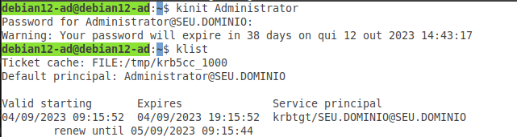

##Editar o arquivo `krb5.conf`

Esta  alteração é necessária para que o sistema mostre a validação do tickets.

O que será alterado e adicionado?

A primeira alteração será na linha: `dns_lookup_realm = false` deve ser alterado para:

`dns_lookup_realm = true`

Adicione estas duas linhas ao seu arquivo, que são obrigatórias para obter os **tickets:**

```
forward = true
forwardable = true
```

A próxima alteração é na linha `realms`. Adicione desta forma, alterando os dados para seu cenário:

```
[realms]
SEU.DOMINIO = {
# Adicione estas linhas abaixo alterando os nomes para seu cenário
admin_server = DEBIAN12-AD.SEU.DOMINIO  
kdc = DEBIAN12-AD.SEU.DOMINIO
}
```

E também a linha `domain_realm`, alterando como mostra abaixo, e altere os dados para seu cenário:

```
[domain_realm]
# E estas duas últimas altere também para atender seu cenário
 debian12-ad = SEU.DOMINIO
 .seu.dominio = SEU.DOMÍNIO
```

Obeserve então, como ficará o arquivo `krb5.conf` 

Editar o arquivo com o comando:

```
nano /etc/krb5.conf
```

```
[libdefaults]
 default_realm = SEU.DOMINIO

# troque esta linha abaixo (dns_lookup_realm) para true
 dns_lookup_realm = true
 dns_lookup_kdc = true

# Estas duas linhas abaixo são obrigatórias para obter os Tickets do KDC
forward = true
forwardable = true

[realms]
SEU.DOMINIO = {
# Adicione estas linhas abaixo alterando os nomes para seu cenário
admin_server = DEBIAN12-AD.SEU.DOMINIO  
kdc = DEBIAN12-AD.SEU.DOMINIO
}

[domain_realm]
# E estas duas últimas altere também para atender seu cenário
 debian12-ad = SEU.DOMINIO
 .seu.dominio = SEU.DOMÍNIO
```

Salve o arquivo:

Para salvar: `control+o` e para sair: `control+x`

Verifique a figura abaixo. Foi executado sem erros:` kinit Administrator` e logo após: `klist`:


